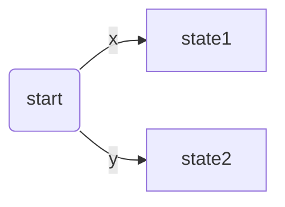
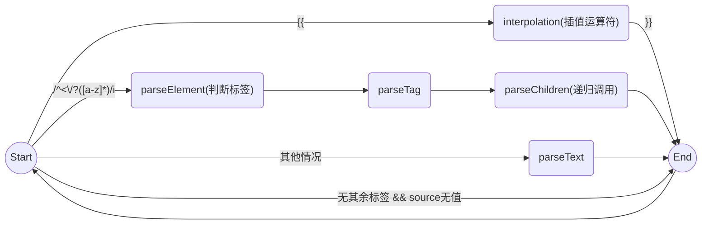

# mini-vue 学习笔记

## nextTick

### nextTick是什么？

> `nextTick()` 等待下一次 DOM 更新刷新的工具方法。
>
> 通常操作数据更新后的DOM
> 
> 当你在 Vue 中更改响应式状态时，最终的 DOM 更新并不是同步生效的，而是由 Vue 将它们缓存在一个队列中，直到下一个“tick”才一起执行。**这样是为了确保每个组件无论发生多少状态改变，都仅执行一次更新。**

> `nextTick()` 可以在状态改变后立即使用，以等待 DOM 更新完成。你可以传递一个**回调函数**作为参数，或者 **await 返回的 Promise**。

### DOM 更新时机

> 当你更改响应式状态后，DOM 会自动更新。然而，你得注意 DOM 的更新并不是同步的。相反，Vue 将缓冲它们直到更新周期的 “下个时机” 以确保无论你进行了多少次状态更改，每个组件都只需要更新一次。
> 
> ps: 在Vue中，状态都是默认深层响应式的。所以即使更改深层的对象或者数组的时候，也能确保能被检测到。(也可以创建浅层响应式对象shallowReactive、shallowRef等)。


### 为何需要nextTick

例如下列代码
```javascript
export const App = {
	name: 'App',
	render() {
		return h('div', {}, [
			h('button', { onClick: this.onClick }, 'update'),
			h('p', {}, `count: ${this.count}`)
		])
	},
	setup() {
		const count = ref(1)

		function onClick() {
			for (let i = 0; i < 100; i++) {
				console.log('update')
				count.value = i
			}
			// nextTick前DOM上的数据还是未更新的数据
			console.log(instance.vnode.el.innerText)

			// nextTick两种用法
			// nextTick后DOM上的数据更新完成
			// await nextTick()
			nextTick(() => {
				console.log(instance.vnode.el.innerText)
			})
		}
		return {
			count,
			onClick
		}
	}
}
```
在上面代码中，如果非异步更新DOM的话，`patch()`会执行100次，所以从性能方面考虑DOM会在下一个 **`tick`** 才更新

### 实现思路

创建一个队列(`queue`)去收集同步任务(`SchedulerJob`)，
当遇到微任务的时候把队列中的任务取出执行

核心代码如下：

```javascript
// 在 runtime-core/scheduler.ts 中
const queue: any[] = []

const resolvedPromise = Promise.resolve() as Promise<any>
let currentFlushPromise: Promise<void> | null = null

let isFlushPending = false
let isFlushing = false

let flushIndex = 0

export function nextTick(fn?) {
	// nextTick 只需要手动去执行下一个tick的方法即可
	const p = currentFlushPromise || resolvedPromise
	return fn ? p.then(fn) : p
}

export function queueJobs(job) {
	// 防止重新添加任务
	if (!queue.length || !queue.includes(job)) {
		if (job.id == null) {
			queue.push(job)
		} else {
			queue.splice(findInsertionIndex(job.id), 0, job)
		}
		// 清空队列
		queueFlush()
	}
}

function queueFlush() {
	if (!isFlushPending) {
		isFlushPending = true
		// 以Promise的方式执行，即在下一个`tick`中执行
		currentFlushPromise = resolvedPromise.then(flushJobs)
	}
}


// 执行队列中的jobs
function flushJobs() {
	isFlushPending = false
	isFlushing = true

	queue.sort(comparator)

	// TODO 错误处理
	try {
		for (flushIndex = 0; flushIndex < queue.length; flushIndex++) {
			const job = queue[flushIndex]
			if (job) {
				job()
			}
		}
	} finally {
		// 执行完后reset
		flushIndex = 0
		queue.length = 0
	}
}

```


## 编译模块

Vue 底层是通过虚拟 DOM 来进行渲染的，那么 `.vue` 文件的模板到底是怎么转换成虚拟 DOM 的呢？

```javascript
// 需要编译器
new Vue({
	template: `<div>{{ hi }}</div>`
})

new Vue(
	render (h) {
		return h('div', {}, this.hi)
	}
)
```
简单来说，就是如果使用了`vue-loader`，就可以使用`vue.runtime.min.js`，将模板编译过程交过给`vue-loader`，如果浏览器直接通过`<script>`引入Vue，需要使用`vue.min.js`，在运行的时候编译模板。

### 编译步骤

1. parse	生成AST(抽象语法树) ==> 可以在`https://astexplorer.net/`看一下AST树 
2. transform	CRUD等操作
3. codegen	通过AST去拼接字符串生成`render()` `https://vue-next-template-explorer.netlify.app/#eyJzcmMiOiI8ZGl2PkhlbGxvIFdvcmxkPC9kaXY+Iiwib3B0aW9ucyI6e319`这里是Vue codegen后生成的函数

### 源码位置

主要是`compiler-core`和`compiler-dom`

## parse

```javascript
export function baseParse(content) {
	// 上下文对象
	const context = createParserContext(content, options)
	const start = getCursor(context)
	return createRoot(
		parseChildren(context, TextModes.DATA, []),
    	getSelection(context, start)
	)
} 

export function createRoot(
  children: TemplateChildNode[],
  loc = locStub
): RootNode {
  return {
    type: NodeTypes.ROOT,
    children,
    helpers: [],
    components: [],
    directives: [],
    hoists: [],
    imports: [],
    cached: 0,
    temps: 0,
    codegenNode: undefined,
    loc
  }
}
```
在`baseParse`创建了一个`context上下文对象`当成全局对象给各个函数来处理，处理string的时候采用处理完就往前推进的方式，生成AST(抽象语法树)


## 有限状态机

**读取**一组输入然后根据这些输入来更改为不同的状态

下面流程图需要用`markdown`中的`mermaid`插件解析




有限状态机在`parse`中的运用机制也是类似



vue3源码中的`parseChildren`方法也有给出对应(HTML标签)的状态扭转的文档`https://html.spec.whatwg.org/multipage/parsing.html`


## transform

遍历AST树做CRUD等操作

遍历树有两种方式，深度优先搜索(DFS)和广度优先搜索(BFS)

这里采用的是深度优先搜索